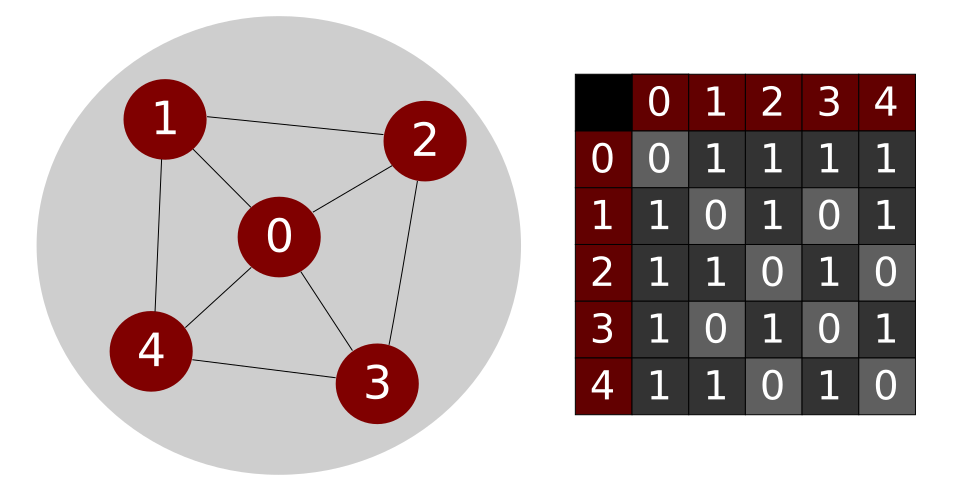

# Enumeration de bicliques maximales d'un gaphe

# Build
Pour constuire le projet :
    mkdir build
    cd build
    cmake ..
Pour construire tout les exectuables : `make`

# Liste des executables
Tout les executables vont être dans le répertoire build.
* draw    : dessine un hexagone à l'écran
* genPerf : génère les données de mesures de performances dans data/perf.dat 

# Liste des macros
Taper les commandes suivantes pour leur effet:
* make plot : génère l'image perf.png et l'affiche
* ctest     : execute tuot les tests du projet
* clean     : supprime les executables